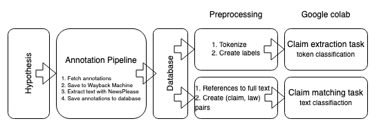

# Bachelor Thesis

## Workflow



1. Annotate on [Hypothesis](https://hypothes.is/users/niklas_thesis)
2. Run annotation pipepline `python annotation_pipline/run_pipeline.py`
    1. Annotations are downloaded from Hypothesis
    2. Annotated webpages are saved to [Wayback Machine](https://web.archive.org/)
    3. Plaintext article is extraced with [NewsPlease](https://github.com/fhamborg/news-please)
    4. `(annotation_id, plaintext, claim_start, claim_end)` is saved to `extraction_data` table in SQLite database
    5. `(annotation_id, claim, referenced_law, date)` is saved to `matching_data` table in SQLite database
  3. Export data: `sqlite3 -header -csv database.db "select plaintext, start, end from extraction_data;" > claim_extraction.csv`
4. Import csv to [colab  notebook](https://colab.research.google.com/drive/1RWNgMftG8JlbKO7-DoQcmdlnpYZSCcCM) and run preprocessing function (TODO)
5. Train

## Project Structure
- `annotation_pipeline` Fetches annotations from Hypothesis, processes them and save them to `database.db`
- `law_scraping`
  - `scrape.py` Scrapes all data from the urls specified in `data/urls/`  to `data/html_pages/`
  - `extract.py` Extracts the laws from `data/html_pages/` to `data/parsed_laws/laws.json` in the [data format](#Format)
  - `data/`
      - `html_pages/` The raw html_pages that were scraped by `scrape.py`
      - `parsed_laws/` The ouput from `extract.py`
      - `urls/` Contains urls from [gesetze.berlin.de](gesetze.berlin.de) for all [coronavirus laws in Berlin](https://de.wikipedia.org/wiki/SARS-CoV-2-Verordnungen_in_Berlin)
- `database.db` Contains `extraction_data` table and `matching_data` table
    
    
## Data format

The parsed laws can currently be found under `data/parsed_laws` in a single `laws.json` file.

The are formatted like this:
```json
{
  "CoronaVVBE4rahmen_4020201107": {
    "§ 1": {
      "titleText": "Grundsätzliche Pflichten",
      "(1)": "{ Text of the first sentence}",
      "(2)": "..."
    },
    "§ 2": {
      "titleText": "..."
    }
  }
}
```
and can be accessed like this: `laws["CoronaVVBE4rahmen_4020201107"]["§ 1"]["(1)"]`

I still have to include dates.
## Next steps
- [ ] Improve `extract.py` (e.g. include dates) The parsing is still awkward
- [ ] Annotate (ongoing on [Hypothesis](https://hypothes.is/users/niklas_thesis))